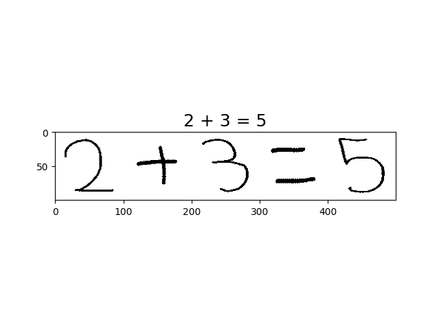

# MathVisual
Perform math operations from image

## Installation
Follow instructions at [installation readme file](docs/install.md)

## Model Training
<!-- Follow instructions at [training/inference readme file](docs/train_inference.md) -->
### 1. Download the dataset
Download the dataset from this [link](https://www.kaggle.com/clarencezhao/handwritten-math-symbol-dataset)

### 2. Training

- conda activate MathVisual

```
    python MathVisual/src/occ/train.py \
        - dataset ABSOLUTE_PATH_TO_DATASET
        - vision TYPE_OF_THE_VISION_MODEL
        - model SAVE_NAME_OF_THE_TRAINED_MODEL
        - batch NUMBER_OF_BATCHES
        - epochs NUMBER_OF_EPOCHS
        - ratio TRAIN_VALIDATION_SPLIT_RATIO(0-1)
        - shuffle SHUFFLE_DATASET_BOOLEAN
```

### 3. Train custom model
1. Create your model under `MathVisual/src/occ/models` folder
2. Import this model in  `MathVisual/src/occ/train.py` and parse `vision` argument
correctly like `custom` and `resnet50`.
3. Start training as in Step-2. 
4. Once training is finished check `checkpoints/` folder to trained model and loss/accuracy csv file under `checkpoints/histories`

### 4. Test trained models
- conda activate MathVisual


```
    python MathVisual/src/occ/inference.py \
        - dataset ABSOLUTE_PATH_TO_DATASET
        - path ABSOLUTE_PATH_TO_MODEL
```

## Example Usage with CLI
- conda activate MathVisual

```
    python MathVisual/src/occ/math_visual.py \
        - path ABSOLUTE_PATH_TO_MODEL
        - image ABSOLUTE_PATH_TO_IMAGE
```

**Example Output**
<p>
  
</p>