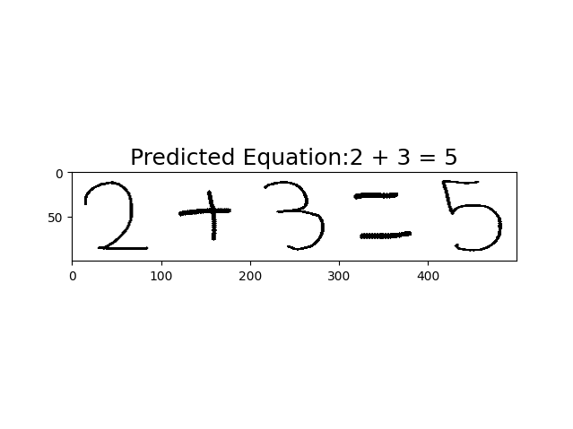

<h1 align="center"> MathVisual </h1>
<h3 align="center"> Perform math operations from image </h3>  

</br>

<p align="center"> 
  
</p>


<!-- TABLE OF CONTENTS -->
<h2 id="table-of-contents"> Table of Contents</h2>

<details open="open">
  <summary>Table of Contents</summary>
  <ol>
    <li><a href="#about-the-project"> ➤ About The Project</a></li>
    <li><a href="#prerequisites"> ➤ Prerequisites</a></li>
    <li><a href="#folder-structure"> ➤ Folder Structure</a></li>
    <li><a href="#dataset"> ➤ Dataset</a></li>
    <li><a href="#preprocessing"> ➤ Preprocessing</a></li>
    <li><a href="#install"> ➤ Installation</a></li>
    <li><a href="#training-testing"> ➤ Training&Testing&Usage</a>
      <ul>
        <li><a href="#training">Training Steps</a></li>
        <li><a href="#add-yours">Add YOUR model</a></li>
        <li><a href="#test">Test Trained Model</a></li>
        <li><a href="#usage">Usage</a></li>
      </ul>
    </li>
    <li><a href="#results-and-discussion"> ➤ Results and Discussion</a>
      <ul>
        <li><a href="#results-training">Model Performance Metrics</a></li>
        <li><a href="#results-training-loss">Loss Function</a></li>
      </ul>
    </li>
    <li><a href="#future"> ➤ Future Work and TODOs</a>
      <ul>
        <li><a href="#dataset-extention">Dataset Extention</a></li>
        <li><a href="#model-improvements">Increasing Model Robostness</a></li>
        <li><a href="#calculus">Performing More Complex Operations Like Integral,Limit,Derivative etc.</a></li>
      </ul>
    </li>
  </ol>
</details>


<!-- ABOUT THE PROJECT -->
<h2 id="about-the-project"> :pencil: About The Project</h2>

<p align="justify">   
  This project aims to perform mathematical equations from raw images with the help of deep computer vision models. Two deep learning models are trained for classficiation one is a custom model and resnet50 model.
  RESNET50 model's only last layer is trained however could not perform well as custom model. Each model's performances will be evaluated later. 

  Models are trained with handwritten characters dataset that also consists symbols of `times,division,substraction and sum`.  
</p>

<!-- PREREQUISITES -->
<h2 id="prerequisites"> :fork_and_knife: Prerequisites</h2>

[](https://www.python.org/) <br>

<!--This project is written in Python programming language. <br>-->
The following open source packages are used in this project:
* Numpy
* Pandas
* Matplotlib
* Scikit-Learn
* TensorFlow
* Keras
* OpenCV


<!-- FOLDER STRUCTURE -->
<h2 id="folder-structure"> :cactus: Folder Structure</h2>

    code
    .
    │
    ├── MathVisual
    │   ├── src
    │   │   ├── occ
    │   │   │   ├── models
    │   │   │   │   ├── custom_model.py
    │   │   │   │   ├── resnet_50.py
    │   │   │   ├── datasets.py
    │   │   │   ├── inference.py
    │   │   │   ├── model.py
    │   │   │   ├── train.py
    │   │   ├── solver.py
    │   │   ├── text_detector.py
    │   │   ├── utils.py
    │   │
    │   ├── main.py
    │   │
    │   │
    ├── docs
    │   ├── install.md
    ├── README.md
    ├── setup.py
    ├── requirements.txt


<!-- DATASET -->
<h2 id="dataset"> :floppy_disk: Dataset</h2>
<p> 

  The HMSD (Handwritten Math Symbols Dataset) dataset includes raw handwritten digits from 0-9 and math symbols (+,-,.,/,x) with total number of 16 classes. 

  The dataset is created from digitally handwritten numbers with white perfect background with a bold type. This fact makes the models trained with that dataset vulnerable to images from wild
  like different backgrounds or different pencil thicknesses. However it is a good way to prototype overall visual math calculator.

  The following image shows the handwritten numbers in dataset.
</p>

<p align="left">
  
</p>

 _The HMSD dataset is publicly available. Please refer to the [Link](https://www.kaggle.com/clarencezhao/handwritten-math-symbol-dataset)_ 


<!-- PREPROCESSING -->
<h2 id="preprocessing"> :hammer: Preprocessing</h2>

<p align="justify"> 
  Images are just resized into (100,100,3) and then normalized. 


<!-- INSTALL HOW TO -->
<h2 id="install"> Installation Steps</h2>

<p align="justify"> 
  Follow steps below,

    conda env create --file  environment.yml
    conda activate MathVisual
    pip install -e .


<p align="Left">
  If you have any problems with opencv try this: pip install opencv-python==4.5.4.60
</p>

</p>


<h2 id="training-testing"> Training-Testing-Usage</h2>

<p align="justify"> 
  Steps to train your MathVisual (assuming you already downloaded the dataset)

<h2 id="training"> :large_orange_diamond: Training Model</h2>

```
    conda activate MathVisual

    python MathVisual/src/occ/train.py \
        - dataset ABSOLUTE_PATH_TO_DATASET
        - vision TYPE_OF_THE_VISION_MODEL
        - model SAVE_NAME_OF_THE_TRAINED_MODEL
        - batch NUMBER_OF_BATCHES
        - epochs NUMBER_OF_EPOCHS
        - ratio TRAIN_VALIDATION_SPLIT_RATIO(0-1)
        - shuffle SHUFFLE_DATASET_BOOLEAN
```
After installation `checkpoints/` folder will be created under main directory and model will be exported here.


<h2 id="add-yours"> :large_orange_diamond: Adding YOUR Model</h2>

  <ol>
    <li>Create your model under `MathVisual/src/occ/models` folder</li> 
    <li>Import this model in  `MathVisual/src/occ/train.py` and parse `vision` argument correctly like `custom` and `resnet50`.</li>
    <li>Start training</li>
    <li>Once training is finished check checkpoints/ folder to trained model and loss/accuracy csv file under checkpoints/histories</li>
  </ol>


<h2 id="test"> :large_orange_diamond: Testing Trained Model</h2>

```
    conda activate MathVisual

    python MathVisual/src/occ/inference.py \
        - dataset ABSOLUTE_PATH_TO_DATASET
        - path ABSOLUTE_PATH_TO_MODEL

```


<h2 id="usage"> :large_orange_diamond: Usage </h2>

```
    conda activate MathVisual

    python MathVisual/main.py \
        - image ABSOLUTE_PATH_TO_IMAGE
        - path ABSOLUTE_PATH_TO_MODEL

```

**Example Output of Usage**
<p>
  
</p>


<h2 id="results-and-discussion"> Results and Discussion</h2>

<p align="justify"> 
  In this section we will deep dive on model evaluation and model details.


<h2 id="#results-training-model-performance"> :large_orange_diamond: Model Performance Metrics </h2>

<p align="Left"> 
Dataset is seperated by two major parts : training and evaluation(testing). More than 70% of data belongs to training set. 

Understanding if model is overfitted to training set, seperating training set 20% as validation has an major role of preventing this problem. 

During training 4 number of metrics are calculated,
  <ol>
    <li>Training Loss</li> 
    <li>Training Accuracy</li> 
    <li>Validation Loss</li> 
    <li>Validation Accuracy</li> 
  </ol>

Ideally, the model must minimize training and validation loss while both training and validation accuracy increases.In that case, 4 of metrics are needed to evaluate the model for training.  
However this is not the fact in reality. In general a curve like below observed, 

**Bias/Variance Trade-off**
<p>
  
</p>


**Model Accuracy and Loss Curves**
<p>
  
</p>


<p>
  
</p>


Evaluating the model with only training metrics is not enought also. By looking model's accuracy and score at test set is also important to understand it's capabilities for generalization. 
Though, not just test set is enough for testing generalization of the model since there would always inputs with different configurations. E.g. handwritten digits with different backgrounds or
handwritten digits with bolded characters. 


<h2 id="#results-training-loss"> :large_orange_diamond: Loss Function (Categorical Cross Entropy) </h2>

<p align="Left"> 
For this classification task, `categorical cross entropy` function is used for the loss function. 
The purpose of categorical cross entropy function is used when multi-class classiciation's labels are one-hot encoded, which means
only the correct class keeps its term in the loss. In the FAIR(facebook AI research team), they observed that categorical cross entropy 
works better than binary cross entropy loss in multi-class classification problems. 


**Categorical Cross-Entropy Loss**
<p>
  
</p>


<h2 id="future"> Future Work and TODOs</h2>

<p align="justify"> 
  List of things to progress in this project in the near future,

<h3 id="dataset-extention"> Dataset Extention</h3>
For now the dataset is very limited to perfect world. It would be better to extend existing dataset with newer images
by putting different handwritten images to different backgrounds. And then re-training the model with new dataset. 


<h3 id="model-improvements"> Increasing Model Robostness</h3>
Model's validation is accuracy is pretty low (around 14%) and weak against unseen images especially to images with different backgrounds,
different tickness. Training a GAN for creating newer samples and then retraining model can help to increase model's robustness.


<h3 id="calculus"> Performing More Complex Operations Like Integral,Limit,Derivative etc.</h3>
Performing only basic mathematical operations is not that useful. By adding newer symbols to dataset, MathVisual must handle more complex
mathematical operations like integral,limit,derivative and trigonometry. 


<h3 id="dockerize"> Dockerize</h3>
Dockerization of environment one of the priorities


<!-- REFERENCES -->
<h2 id="references"> :books: References</h2>

<ul>
  <li>
    <p>https://gombru.github.io/2018/05/23/cross_entropy_loss/</p>
  </li>
</ul>

<!-- CONTRIBUTORS -->
<h2 id="contributors"> :scroll: Contributors</h2>
<ul>
  <li>
    <p>Furkan Ayik, furkanayik@outlook.com</p>
  </li>
</ul>