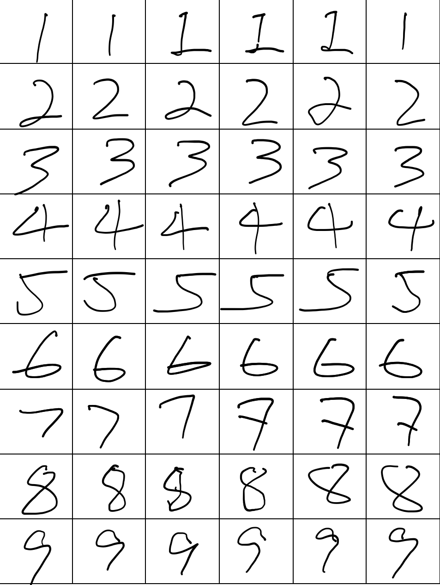

<h1 align="center"> MathVisual </h1>
<h3 align="center"> Perform math operations from image </h3>  

</br>

<p align="center"> 
  
</p>


<!-- TABLE OF CONTENTS -->
<h2 id="table-of-contents"> Table of Contents</h2>

<details open="open">
  <summary>Table of Contents</summary>
  <ol>
    <li><a href="#about-the-project"> ➤ About The Project</a></li>
    <li><a href="#prerequisites"> ➤ Prerequisites</a></li>
    <li><a href="#folder-structure"> ➤ Folder Structure</a></li>
    <li><a href="#dataset"> ➤ Dataset</a></li>
    <li><a href="#preprocessing"> ➤ Preprocessing</a></li>
    <li><a href="#install"> ➤ Installation</a></li>
    <li><a href="#training-testing"> ➤ Training&Testing&Usage</a></li>
    <li><a href="#results-and-discussion"> ➤ Results and Discussion</a></li>
    <li><a href="#future"> ➤ Future Work and TODOs</a></li>
    <li><a href="#contributors"> ➤ Contributors</a></li>
  </ol>
</details>


<!-- ABOUT THE PROJECT -->
<h2 id="about-the-project"> :pencil: About The Project</h2>

<p align="justify">   
  This project aims to perform mathematical equations from raw images with the help of deep computer vision models. Two deep learning models are trained for classficiation one is a custom model and resnet50 model.
  RESNET50 model's only last layer is trained however could not perform well as custom model. Each model's performances will be evaluated later. 

  Models are trained with handwritten characters dataset that also consists symbols of `times,division,substraction and sum`.  
</p>

<!-- PREREQUISITES -->
<h2 id="prerequisites"> :fork_and_knife: Prerequisites</h2>

[](https://www.python.org/) <br>

<!--This project is written in Python programming language. <br>-->
The following open source packages are used in this project:
* Numpy
* Pandas
* Matplotlib
* Scikit-Learn
* TensorFlow
* Keras
* OpenCV


<!-- FOLDER STRUCTURE -->
<h2 id="folder-structure"> :cactus: Folder Structure</h2>

    code
    .
    │
    ├── MathVisual
    │   ├── src
    │   │   ├── occ
    │   │   │   ├── models
    │   │   │   │   ├── custom_model.py
    │   │   │   │   ├── resnet_50.py
    │   │   │   ├── datasets.py
    │   │   │   ├── inference.py
    │   │   │   ├── model.py
    │   │   │   ├── train.py
    │   │   ├── solver.py
    │   │   ├── text_detector.py
    │   │   ├── utils.py
    │   │
    │   ├── main.py
    │   │
    │   │
    ├── docs
    │   ├── install.md
    ├── README.md
    ├── setup.py
    ├── requirements.txt


<!-- DATASET -->
<h2 id="dataset"> :floppy_disk: Dataset</h2>
<p> 

  The HMSD (Handwritten Math Symbols Dataset) dataset includes raw handwritten digits from 0-9 and math symbols (+,-,.,/,x) with total number of 16 classes. 

  The dataset is created from digitally handwritten numbers with white perfect background with a bold type. This fact makes the models trained with that dataset vulnerable to images from wild
  like different backgrounds or different pencil thicknesses. However it is a good way to prototype overall visual math calculator.

  The following image shows the handwritten numbers in dataset.
</p>

<p align="left">
  
</p>

 _The HMSD dataset is publicly available. Please refer to the [Link](https://www.kaggle.com/clarencezhao/handwritten-math-symbol-dataset)_ 


<!-- PREPROCESSING -->
<h2 id="preprocessing"> :hammer: Preprocessing</h2>

<p align="justify"> 
  Images are just resized into (100,100,3) and then normalized. 


<!-- INSTALL HOW TO -->
<h2 id="install"> Installation Steps</h2>

<p align="justify"> 
  Follow steps below,

    conda env create --file  environment.yml
    conda activate MathVisual
    pip install -e .


<p align="Left">
  If you have any problems with opencv try this: pip install opencv-python==4.5.4.60
</p>

</p>


<h2 id="training-testing"> Training-Testing-Usage</h2>

<p align="justify"> 
  Steps to train your MathVisual (assuming you already downloaded the dataset)

```
    conda activate MathVisual

    python MathVisual/src/occ/train.py \
        - dataset ABSOLUTE_PATH_TO_DATASET
        - vision TYPE_OF_THE_VISION_MODEL
        - model SAVE_NAME_OF_THE_TRAINED_MODEL
        - batch NUMBER_OF_BATCHES
        - epochs NUMBER_OF_EPOCHS
        - ratio TRAIN_VALIDATION_SPLIT_RATIO(0-1)
        - shuffle SHUFFLE_DATASET_BOOLEAN
```
